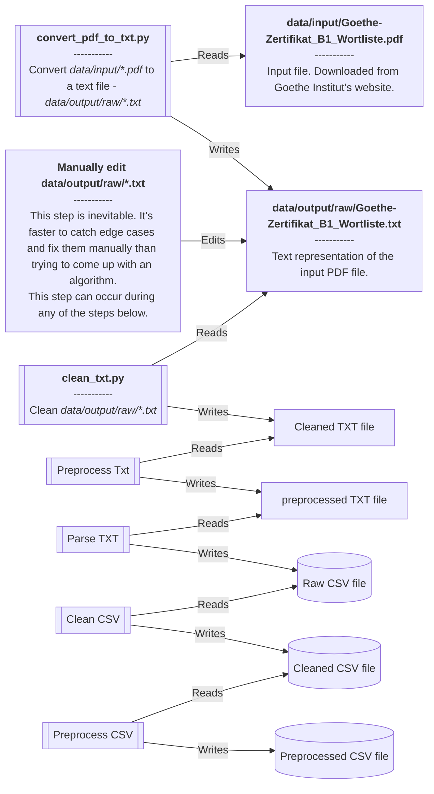

# Development

This document describes the process for running this application on your local computer.

## Getting started

> [!NOTE]  
> The software ran smoothly on Ubuntu 22.04. However, there's no guarantee it will work on Windows, despite using adaptable modules.

You need [`pdftotext`](https://www.xpdfreader.com/pdftotext-man.html) to run the conversion script([convert_pdf_to_txt.py](src/convert_pdf_to_txt.py)). `pdftotext` is included with [the `poppler` library](https://poppler.freedesktop.org/).

```shell
git clone https://github.com/stoyanK7/BG-DE-anki-decks.git
cd BG-DE-anki-decks
pipenv sync --dev
```

## Run the whole pipeline

```shell
python3 src/clean_txt.py \
    && python3 src/preprocess_txt.py \
    && python3 src/parse_txt.py \
    && python3 src/clean_csv.py \
    && python3 src/preprocess_csv.py \
    && python3 src/translate.py \
    && python3 src/create_audio.py \
    && python3 src/postprocess_csv.py \
    && python3 src/generate_deck.py
```

## Process


