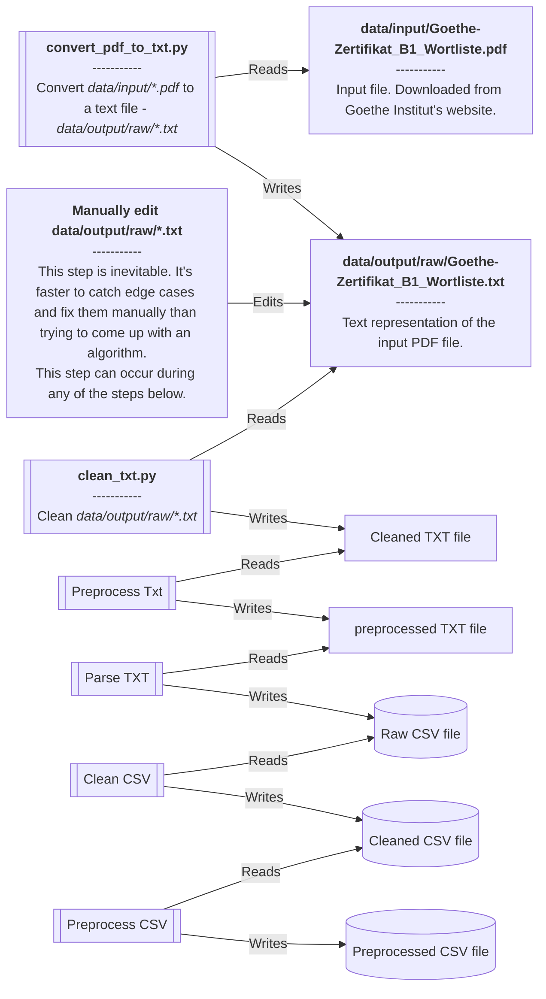

# Development

This document describes the process for running this application on your local machine.

> [!IMPORTANT]
> This software was developed and tested only on Ubuntu 22.04.

<!-- TOC -->
* [Development](#development)
  * [Getting started](#getting-started)
  * [Activating the environment](#activating-the-environment)
  * [Running the whole pipeline](#running-the-whole-pipeline)
  * [Running an individual step](#running-an-individual-step)
  * [Running the linter](#running-the-linter)
  * [Pipeline explanations](#pipeline-explanations)
<!-- TOC -->

## Getting started

```shell
git clone https://github.com/stoyanK7/BG-DE-anki-decks.git
cd BG-DE-anki-decks
pipenv sync --dev
```

## Activating the environment

```shell
pipenv shell
```

## Running the whole pipeline

```shell
./run.sh
```

## Running an individual step

```shell
python3 src/XX_step_you_want_to_run.py
```

## Running the linter

```shell
ruff format . && ruff check . --fix .
```

## Pipeline explanations


